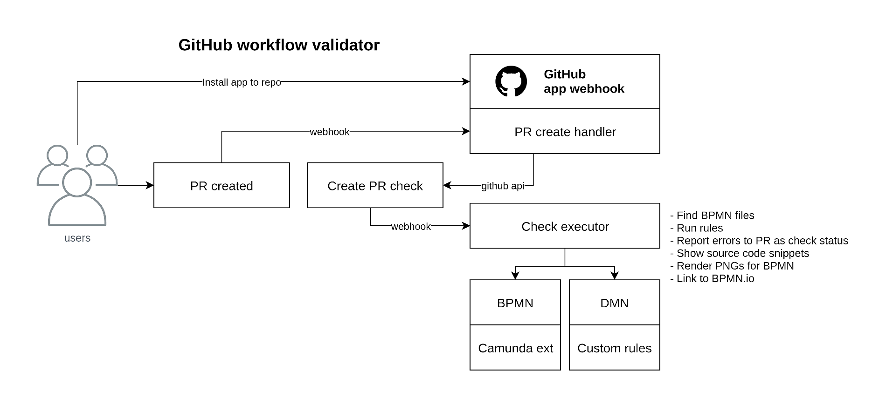

# Workflow validator

Validates BPMN and DMN models in GitHub, GitLab (TBD) and locally invoked `npx bpmlint` or `yarn dmnlint`

https://smee.io/8C0Z4NayzAPLUnCV

## Links

  * https://www.npmjs.com/package/bpmn-js
  * bpmmn-moddle
  * camunda-bpmn-moddle
  * https://github.com/bkeepers/github-app-example
  * https://github.com/octokit/rest.js
  * https://github.com/probot/github-app
  * https://developer.github.com/webhooks/securing/
  * https://medium.com/ahmed-t-ali/lets-build-a-github-pro-bot-5e155cec395f
  * https://developer.github.com/v3/guides/working-with-comments/#pull-request-comments
  * https://github.com/settings/apps/workflow-validator/advanced
  * https://probot.github.io/docs/configuration/
  * https://github.com/huksley/aws-detect-faces-workflow/pull/1
  * http://octokit.github.io/rest.js/
  * https://probot.github.io/docs/best-practices/
  * https://github.com/isomorphic-git/isomorphic-git-bot/blob/glitch/index.js
  * https://isomorphic-git.org/
  * https://github.com/streamich/memfs
